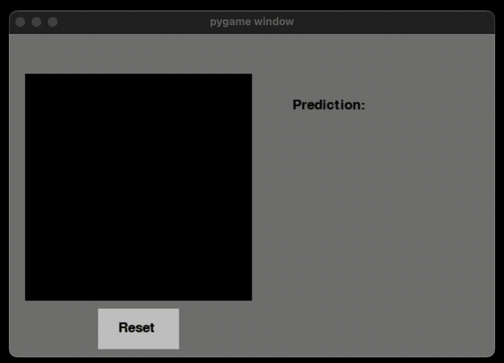

# DNN Digit Predictor

DNN Digit Predictorは[「ゼロから作るDeep Learning」](https://www.amazon.co.jp/dp/4873117585?ref_=cm_sw_r_cp_ud_dp_D4WTQD6YZC7XPRNG5K9V)で学んだディープニューラルネットワークを用いて、キャンバスに描かれた数字を推定するPygame生のアプリケーションです。

画面左の黒いキャンバスにマウスで数字を描画すると、画面左に描かれた数字を認識した結果が表示されます。

## Dependency
